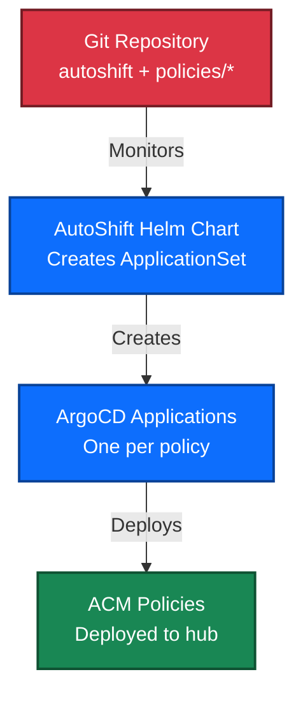
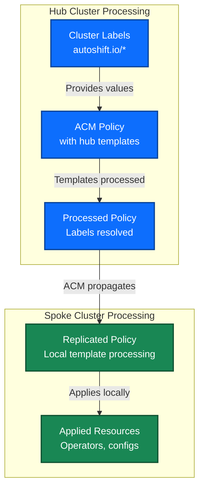
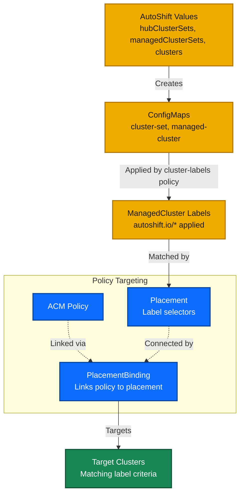

# AutoShiftv2 - Developer Guide

[](LICENSE)
[](https://www.openshift.com/)
[](https://www.redhat.com/en/technologies/management/advanced-cluster-management)

**Build and manage OpenShift Platform Plus infrastructure as code with policy-driven automation**

## 🚀 Quick Start - Create Your First Policy

Generate and deploy an operator policy in under 5 minutes:

```bash
# 1. Generate a new operator policy with AutoShift integration and version pinning
./scripts/generate-operator-policy.sh cert-manager cert-manager-operator --channel stable --namespace cert-manager --version cert-manager.v1.14.4 --add-to-autoshift

# 2. Validate the generated policy
helm template policies/cert-manager/

# 3. Commit and push - AutoShift will automatically deploy via GitOps
git add policies/cert-manager/
git commit -m "Add cert-manager operator policy"
git push origin main  # or your branch if contributing
```

Your operator is now being deployed across your clusters! Check the ArgoCD dashboard to monitor progress.

## 📋 Table of Contents

- [Architecture Overview](#-architecture-overview)
- [Developer Setup](#-developer-setup)
- [Creating Your First Policy](#-creating-your-first-policy)
- [Policy Development Guide](#-policy-development-guide)
- [Common Development Tasks](#-common-development-tasks)
- [Testing and Validation](#-testing-and-validation)
- [Contributing](#-contributing)
- [Troubleshooting](#-troubleshooting)
- [Additional Resources](#-additional-resources)

## 🏗️ Architecture Overview

AutoShiftv2 orchestrates OpenShift infrastructure through a sophisticated GitOps and policy-driven architecture:

### 1. GitOps Flow - Source to Deployment



### 2. Policy Processing - Hub Templates to Spoke Deployment



### 3. Cluster Targeting - Label-Based Policy Distribution



**Key Components & Flow:**

1. **GitOps Foundation**: ArgoCD ApplicationSet monitors `policies/*` directories in Git repository
2. **Dynamic Application Creation**: ApplicationSet creates individual ArgoCD Applications for each policy
3. **Helm Chart Deployment**: Each Application deploys a Helm chart containing ACM Policy + Placement + PlacementBinding
4. **Hub Template Processing**: ACM processes policy templates on hub cluster using cluster labels from ConfigMaps
5. **Policy Propagation**: ACM Policy Framework propagates processed policies to target spoke clusters
6. **Spoke Template Processing**: Policy agents on spoke clusters process templates again with local cluster context
7. **Resource Application**: Final Kubernetes resources are applied on spoke clusters

**Label-Driven Configuration:**
- **cluster-labels policy**: Applies `autoshift.io/*` labels to clusters from ConfigMaps
- **Hub templates**: `{{hub index .ManagedClusterLabels "autoshift.io/key" hub}}` access cluster labels
- **Placement matching**: Selects target clusters using label expressions and cluster sets
- **Dynamic behavior**: Same policy template produces different resources per cluster based on labels

## 🛠️ Developer Setup

### Prerequisites

| Tool | Version | Installation |
|------|---------|-------------|
| OpenShift CLI | Latest | [Download oc](https://docs.redhat.com/en/documentation/openshift_container_platform/latest/html/cli_tools/openshift-cli-oc#installing-openshift-cli) |
| Helm | 3.x | [Install Helm](https://helm.sh/docs/intro/install/) |
| Git | 2.x+ | Pre-installed on most systems |
| Access to Hub Cluster | - | Admin or developer access required |

### Repository Setup

```bash
# Clone the repository (or your fork if contributing)
git clone https://github.com/auto-shift/autoshiftv2.git
cd autoshiftv2

# Verify the policy generator works
./scripts/generate-operator-policy.sh --help

# Test policy generation
./scripts/generate-operator-policy.sh test-operator test-operator --channel stable --namespace test-operator
helm template policies/test-operator/

# Clean up test
rm -rf policies/test-operator/
```

### First-Time Setup Validation

```bash
# Check existing policies
ls -la policies/

# Validate all existing policies (optional but recommended)
for policy in policies/*/; do
  if [ -f "$policy/Chart.yaml" ]; then
    echo "Validating $policy..."
    helm template "$policy" > /dev/null && echo "✓ Valid" || echo "✗ Invalid"
  fi
done
```

## 💡 Creating Your First Policy

### Step 1: Research Your Operator

Before generating a policy, gather key information:

```bash
# Search for operator in OperatorHub
oc get packagemanifests -n openshift-marketplace | grep -i your-operator

# Get operator details
oc describe packagemanifest your-operator -n openshift-marketplace
```

### Step 2: Generate the Policy

```bash
# For cluster-scoped operators (most common)
./scripts/generate-operator-policy.sh \
  my-component \
  my-operator-subscription \
  --channel stable \
  --namespace my-component \
  --add-to-autoshift

# For namespace-scoped operators
./scripts/generate-operator-policy.sh \
  my-component \
  my-operator-subscription \
  --channel stable \
  --namespace my-component \
  --namespace-scoped \
  --add-to-autoshift
```

### Step 3: Understand Generated Files

Your new policy directory (`policies/my-component/`) contains:

```
policies/my-component/
├── Chart.yaml                          # Helm chart metadata
├── values.yaml                         # Default configuration
├── README.md                           # Policy documentation
└── templates/
    └── policy-my-component-operator-install.yaml  # RHACM Policy
```

### Step 4: Add Operator Configuration

Most operators need additional configuration after installation:

```bash
# 1. Explore installed CRDs
oc get crds | grep my-component

# 2. Create configuration policy
cat > policies/my-component/templates/policy-my-component-config.yaml << 'EOF'
{{- $policyName := "policy-my-component-config" }}
{{- $placementName := "placement-policy-my-component-config" }}

apiVersion: policy.open-cluster-management.io/v1
kind: Policy
metadata:
  name: {{ $policyName }}
  namespace: {{ .Values.policy_namespace }}
  annotations:
    policy.open-cluster-management.io/standards: NIST SP 800-53
    policy.open-cluster-management.io/categories: CM Configuration Management
    policy.open-cluster-management.io/controls: CM-2 Baseline Configuration
spec:
  disabled: false
  policy-templates:
    - objectDefinition:
        apiVersion: policy.open-cluster-management.io/v1
        kind: ConfigurationPolicy
        metadata:
          name: my-component-instance
        spec:
          remediationAction: enforce
          severity: high
          object-templates:
            - complianceType: musthave
              objectDefinition:
                apiVersion: my-component.io/v1
                kind: MyComponentInstance
                metadata:
                  name: instance
                  namespace: {{ .Values.myComponent.namespace }}
                spec:
                  # Add your configuration here
                  replicas: 3
                  storage:
                    size: 10Gi
---
apiVersion: cluster.open-cluster-management.io/v1beta1
kind: Placement
metadata:
  name: {{ $placementName }}
  namespace: {{ .Values.policy_namespace }}
spec:
  clusterSets:
  {{- range $clusterSet, $value := $.Values.hubClusterSets }}
    - {{ $clusterSet }}
  {{- end }}
  {{- range $clusterSet, $value := $.Values.managedClusterSets }}
    - {{ $clusterSet }}
  {{- end }}
  predicates:
    - requiredClusterSelector:
        labelSelector:
          matchExpressions:
            - key: 'autoshift.io/my-component'
              operator: In
              values:
              - 'true'
  tolerations:
    - key: cluster.open-cluster-management.io/unreachable
      operator: Exists
    - key: cluster.open-cluster-management.io/unavailable
      operator: Exists
---
apiVersion: policy.open-cluster-management.io/v1
kind: PlacementBinding
metadata:
  name: {{ $placementName }}
  namespace: {{ .Values.policy_namespace }}
placementRef:
  name: {{ $placementName }}
  apiGroup: cluster.open-cluster-management.io
  kind: Placement
subjects:
  - name: {{ $policyName }}
    apiGroup: policy.open-cluster-management.io
    kind: Policy
EOF
```

### Step 5: Test and Deploy

```bash
# Validate your policy renders correctly
helm template policies/my-component/

# Commit and push to deploy
git add policies/my-component/
git commit -m "Add my-component operator with configuration"
git push

# Monitor deployment in ArgoCD
oc get applications -n openshift-gitops | grep my-component
```

## 📚 Policy Development Guide

### Policy Development Workflow


### Working with Hub Template Functions

AutoShiftv2 uses RHACM hub templates to access cluster labels dynamically:

```yaml
# Access cluster labels for dynamic configuration
channel: '{{ "{{hub" }} index .ManagedClusterLabels "autoshift.io/my-component-channel" | default "stable" {{ "hub}}" }}'

# Conditional configuration based on labels
'{{ "{{hub" }} $clusterType := index .ManagedClusterLabels "autoshift.io/cluster-type" | default "development" {{ "hub}}" }}'
'{{ "{{hub" }} if eq $clusterType "production" {{ "hub}}" }}'
  replicas: 5
'{{ "{{hub" }} else {{ "hub}}" }}'
  replicas: 1
'{{ "{{hub" }} end {{ "hub}}" }}'

# Using subscription name from labels
name: '{{ "{{hub" }} index .ManagedClusterLabels "autoshift.io/my-component-subscription-name" | default "my-component-operator" {{ "hub}}" }}'
```

### Label-Based Configuration

Labels are configured in AutoShift values files and propagated to clusters by the cluster-labels policy:

```yaml
# In autoshift/values.hub.yaml - configure labels for cluster sets
hubClusterSets:
  hub:
    labels:
      my-component: 'true'
      my-component-subscription-name: 'my-component-operator'
      my-component-channel: 'stable'

managedClusterSets:
  managed:
    labels:
      my-component: 'true'
      my-component-subscription-name: 'my-component-operator'
      my-component-channel: 'fast'  
# Individual cluster overrides in same values file
clusters:
  prod-cluster-1:
    labels:
      my-component-channel: 'stable-1.2'  ```

Configuration precedence: **Individual Cluster > ClusterSet > Default Values**

### Dependency Management

AutoShift handles dependencies through logical ordering and shared placement rules. For explicit dependencies, add to policy spec.dependencies section like the example below:

```yaml
# In policies/my-component/README.md
## Dependencies

This policy depends on:
- OpenShift Data Foundation (ODF) - provides storage for my-component
- Loki - provides logging infrastructure

apiVersion: policy.open-cluster-management.io/v1
kind: Policy
metadata:
  name: policy-my-component-install
  namespace: {{ .Values.policy_namespace }}
spec:
  dependencies:
    - name: policy-storage-cluster-test
      namespace: {{ .Values.policy_namespace }}
      apiVersion: policy.open-cluster-management.io/v1
      compliance: Compliant
      kind: Policy
    - name: policy-loki-operator-install
      namespace: {{ .Values.policy_namespace }}
      apiVersion: policy.open-cluster-management.io/v1
      compliance: Compliant
      kind: Policy

## Deployment Order

1. ODF must be running before deploying my-component
2. Loki should be installed
```

## 🔧 Common Development Tasks

### Updating an Existing Policy

```bash
# 1. Make changes to policy templates
vi policies/my-component/templates/policy-my-component-config.yaml

# 2. Validate changes
helm template policies/my-component/

# 3. Update with different label values
vi autoshift/values.sbx.yaml
vi autoshift/values.hub.yaml

# 4. Commit and deploy
git add policies/my-component/
git add autoshift/
git commit -m "Update my-component configuration"
git push

# 5. Validate on sandbox cluster that is pointing to your branch

```

### Debugging Policy Issues

```bash
# Check policy status
oc get policies -A | grep my-component

# View policy details - namespace can be found from previous command
oc describe policy policy-my-component-operator-install -n policies-autoshift

# View ArgoCD sync status
oc get applications -n openshift-gitops my-component -o yaml
```

### Working with Disconnected Environments

```bash
# Generate ImageSet for disconnected environments (see oc-mirror/README.md)
cd oc-mirror
./generate-imageset-config.sh values.hub.yaml,values.sbx.yaml \
  --operators-only \
  --output imageset-multi-env.yaml
cd ..
```

## 🧪 Testing and Validation

### Local Validation

```bash
# Validate single policy
helm template policies/my-component/ | oc apply --dry-run=client -f -

# Validate all policies
find policies/ -name "Chart.yaml" -exec dirname {} \; | while read policy; do
  echo "Testing $policy..."
  helm template "$policy" > /dev/null 2>&1 || echo "FAILED: $policy"
done
```

### Compliance Validation

```bash
# Check policy compliance across clusters
oc get policies -A \
  -o custom-columns=NAME:.metadata.name,COMPLIANT:.status.compliant

# Get detailed compliance status
oc get policyreports -A
```

## 🤝 Contributing

### Contribution Workflow

1. **Fork and Clone**
   ```bash
   # First, fork the repository on GitHub web interface:
   # Navigate to: https://github.com/auto-shift/autoshiftv2
   # Click "Fork" button in the top right

   # Then clone your fork
   git clone https://github.com/YOUR-USERNAME/autoshiftv2.git
   cd autoshiftv2

   # Add upstream remote to keep your fork in sync
   git remote add upstream https://github.com/auto-shift/autoshiftv2.git
   ```

2. **Create Feature Branch**
   ```bash
   git checkout -b feature/add-my-operator-policy
   ```

3. **Generate and Develop Policy**
   ```bash
   ./scripts/generate-operator-policy.sh my-operator my-operator --channel stable --namespace my-operator
   # Add operator-specific configuration
   ```

4. **Test Thoroughly**
   ```bash
   helm template policies/my-operator/
   # Deploy and validate in test environment
   ```

5. **Submit Pull Request**
   ```bash
   git add policies/my-operator/
   git commit -m "Add my-operator policy with configuration"
   git push origin feature/add-my-operator-policy
   ```

   After pushing, create a pull request via GitHub web interface:
   - Navigate to your fork: `https://github.com/YOUR-USERNAME/autoshiftv2`
   - GitHub will show a banner "Compare & pull request" for your recent branch
   - Or manually go to: `https://github.com/auto-shift/autoshiftv2/compare/main...YOUR-USERNAME:feature/add-my-operator-policy`
   - Fill out the PR template with a clear title and description

### Code Standards

- ✅ Use policy generator for all new operator policies
- ✅ Include comprehensive README.md for each policy
- ✅ Follow existing naming conventions
- ✅ Test with `helm template` before committing
- ✅ Add subscription-name labels for all operators
- ✅ Document any special configuration requirements

### Pull Request Checklist

- [ ] Policy generated using `generate-operator-policy.sh`
- [ ] Subscription name and channel specified
- [ ] Configuration policies added if needed
- [ ] README.md updated with usage instructions
- [ ] Tested with `helm template`
- [ ] Deployed and validated in test environment
- [ ] No hardcoded values (use templates)
- [ ] Add Labels to AutoShift Values files

## 🔍 Troubleshooting

### Common Issues and Solutions

| Issue | Solution |
|-------|----------|
| Policy not applying to cluster | Check cluster labels: `oc get managedcluster $CLUSTER_NAME -o yaml` |
| Operator installation failing | Check OperatorPolicy status: `oc describe operatorpolicy OPERATOR_POLICY_NAME -n $CLUSTER_NAME` |
| Template rendering errors | Check policy status: `oc describe policy POLICY_NAME -n policies-autoshift` |
| ArgoCD sync failures | Check application status: `oc get applications -n openshift-gitops POLICY_NAME -o yaml` |
| Policy stuck in NonCompliant | Check OperatorPolicy or ConfigurationPolicy status (see debug commands) |
| Configuration not applied | Check ConfigurationPolicy status: `oc describe configurationpolicy CONFIG_POLICY_NAME -n $CLUSTER_NAME` |
| Hub template processing issues | View policy propagator logs (see debug commands) |

### Debug Commands

```bash
# Set cluster name variable for your environment
# Find your cluster name if you don't know it
oc get managedclusters
export CLUSTER_NAME="local-cluster"  # Replace with your actual cluster name

# 1. FIRST: Check all policies and their compliance status
oc get policies -A

# 2. Check specific policy resource status

# For operator installation issues:
oc get operatorpolicy -A
oc describe operatorpolicy OPERATOR_POLICY_NAME -n $CLUSTER_NAME

# For configuration/non-operator issues:
oc get configurationpolicy -A
oc describe configurationpolicy CONFIG_POLICY_NAME -n $CLUSTER_NAME

# 3. Check specific policy details (use actual namespace from step 1)
oc describe policy POLICY_NAME -n policies-autoshift

# 4. Check ArgoCD application status
oc get applications -n openshift-gitops

# 5. View specific ArgoCD application details
oc get application autoshift-POLICY_NAME -n openshift-gitops -o yaml

# 6. Check cluster labels (hub template variables)
oc get managedcluster $CLUSTER_NAME -o yaml

# 7. View ACM policy propagator logs
oc logs -n open-cluster-management deployment/grc-policy-propagator

# 8. Check placement decisions (which clusters policies target)
oc get placementdecisions -A

# 9. View cluster import and connectivity status
oc get managedclusters

# 10. Check package manifests for operator details
oc get packagemanifests -n openshift-marketplace | grep OPERATOR_NAME
oc describe packagemanifest OPERATOR_NAME -n openshift-marketplace

# 11. General policy controller logs
oc logs -n open-cluster-management-agent-addon deployment/config-policy-controller

# 12. Check events in operator namespaces
oc get events -n OPERATOR_NAMESPACE --sort-by='.lastTimestamp'
```

### Finding Non-Compliant Policies

```bash
# Find NonCompliant policies
oc get policies -A | grep "NonCompliant"

# Find policies with missing/blank compliance status (excluding header)
oc get policies -A | grep -v "Compliant" | grep -v "COMPLIANCE STATE"

# Find NonCompliant OperatorPolicy resources
oc get operatorpolicy -A -o custom-columns="NAMESPACE:.metadata.namespace,NAME:.metadata.name,COMPLIANT:.status.compliant" | grep "NonCompliant"

# Find NonCompliant ConfigurationPolicy resources
oc get configurationpolicy -A -o custom-columns="NAMESPACE:.metadata.namespace,NAME:.metadata.name,COMPLIANT:.status.compliant" | grep "NonCompliant"

# Alternative: Show all and manually review
echo "=== All Policies ==="
oc get policies -A
echo "=== OperatorPolicy Status ==="
oc get operatorpolicy -A -o custom-columns="NAMESPACE:.metadata.namespace,NAME:.metadata.name,COMPLIANT:.status.compliant"
echo "=== ConfigurationPolicy Status ==="
oc get configurationpolicy -A -o custom-columns="NAMESPACE:.metadata.namespace,NAME:.metadata.name,COMPLIANT:.status.compliant"

# Get details for a specific non-compliant policy
POLICY_NAME="policy-acs-operator-install"  # Example policy name
POLICY_NAMESPACE="policies-autoshift"

# Check the main policy status
oc describe policy $POLICY_NAME -n $POLICY_NAMESPACE

# Find related OperatorPolicy resources for this policy
oc get operatorpolicy -A -o json | jq -r '.items[] | select(.metadata.labels["policy.open-cluster-management.io/policy"] == "'$POLICY_NAMESPACE'.'$POLICY_NAME'") | "\(.metadata.namespace)/\(.metadata.name)"'

# Find related ConfigurationPolicy resources for this policy
oc get configurationpolicy -A -o json | jq -r '.items[] | select(.metadata.labels["policy.open-cluster-management.io/policy"] == "'$POLICY_NAMESPACE'.'$POLICY_NAME'") | "\(.metadata.namespace)/\(.metadata.name)"'

# Example: Find all resources related to ACS operator policy
POLICY_NAME="policy-acs-operator-install"
echo "=== Related OperatorPolicy resources ==="
oc get operatorpolicy -A -o json | jq -r '.items[] | select(.metadata.labels["policy.open-cluster-management.io/policy"] == "policies-autoshift.'$POLICY_NAME'") | "\(.metadata.namespace)/\(.metadata.name)"'

echo "=== Related ConfigurationPolicy resources ==="
oc get configurationpolicy -A -o json | jq -r '.items[] | select(.metadata.labels["policy.open-cluster-management.io/policy"] == "policies-autoshift.'$POLICY_NAME'") | "\(.metadata.namespace)/\(.metadata.name)"'

# Describe the related resources found above (replace with actual names from commands above)
oc describe operatorpolicy install-operator-acs -n $CLUSTER_NAME
oc describe configurationpolicy managed-cluster-security-ns -n $CLUSTER_NAME
```

## 📖 Additional Resources

### Documentation
- [Policy Quick Start Documentation](scripts/README.md)
- [OpenShift GitOps Documentation](https://docs.openshift.com/container-platform/latest/cicd/gitops/understanding-openshift-gitops.html)
- [RHACM Policy Framework](https://access.redhat.com/documentation/en-us/red_hat_advanced_cluster_management_for_kubernetes/)

### Training
- [DO480: Multicluster Management with Red Hat OpenShift Platform Plus](https://www.redhat.com/en/services/training/do480-multicluster-management-red-hat-openshift-platform-plus)

### Community
- [GitHub Issues](https://github.com/auto-shift/autoshiftv2/issues) - Report bugs or request features
- [Discussions](https://github.com/auto-shift/autoshiftv2/discussions) - Ask questions and share ideas

---

**Ready to contribute?** Start by [creating your first policy](#-creating-your-first-policy) or explore our [existing policies](policies/) for examples!