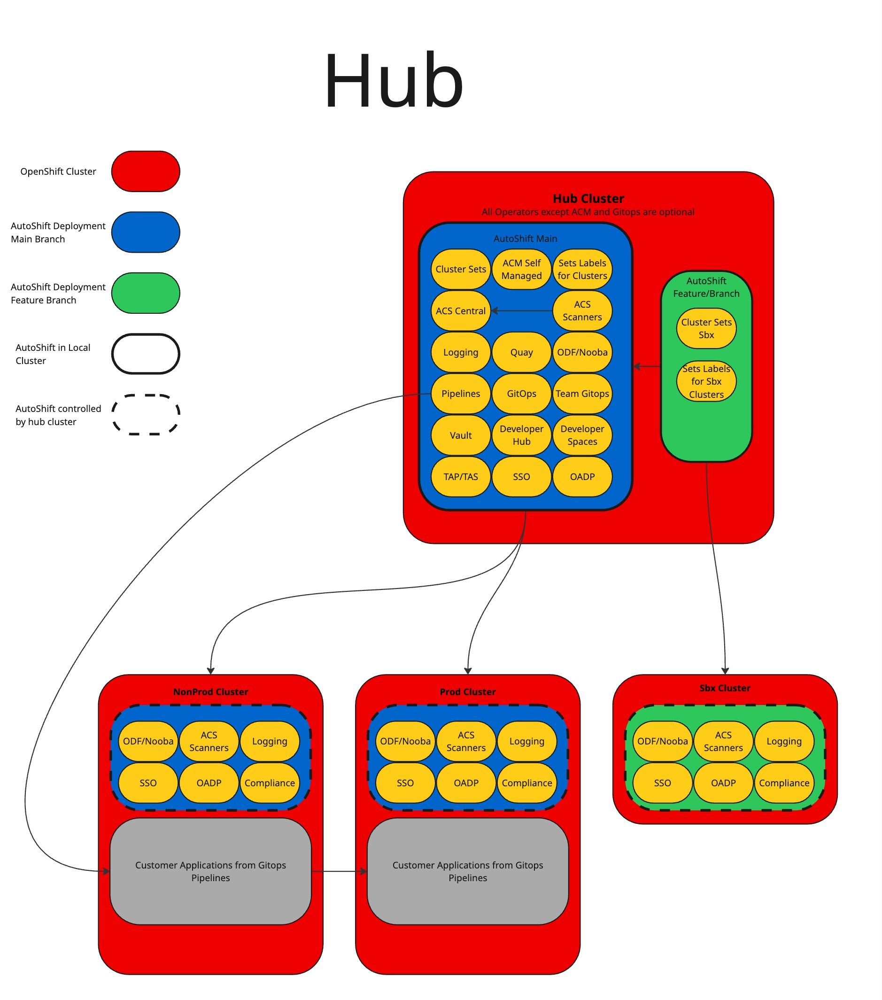
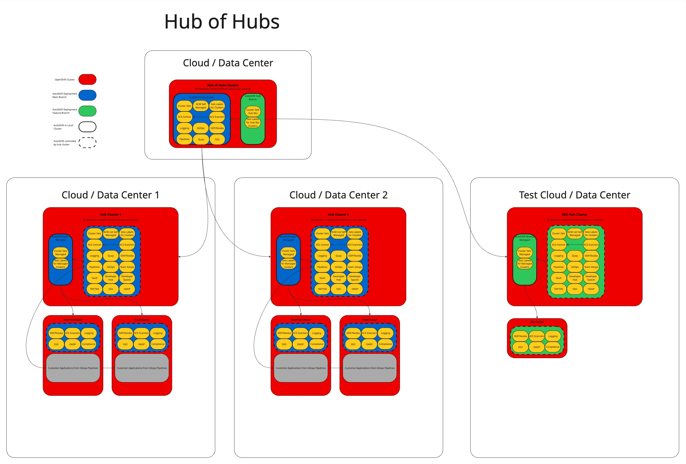
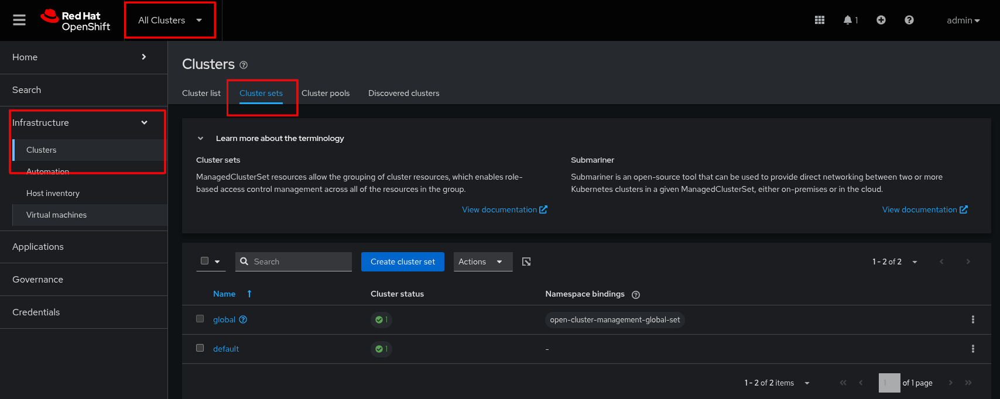
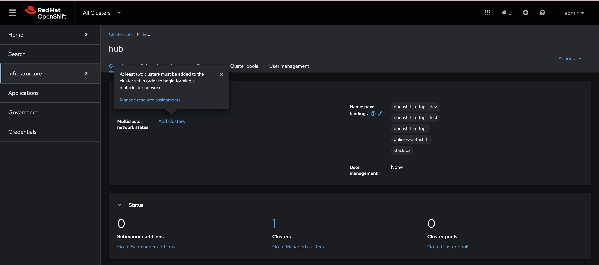
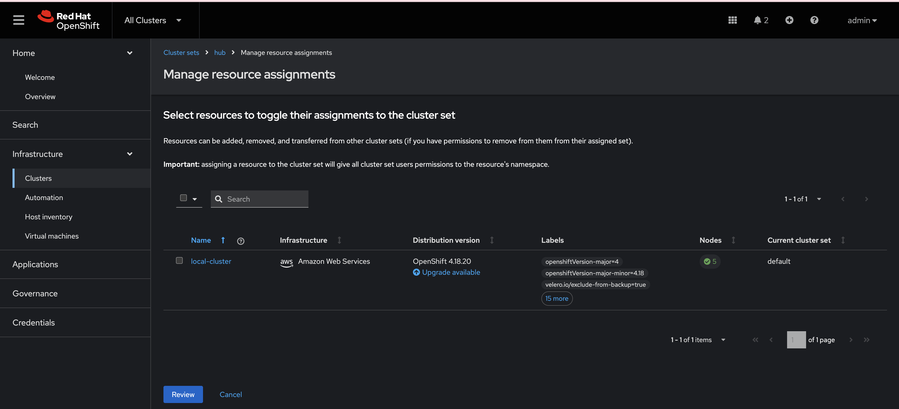
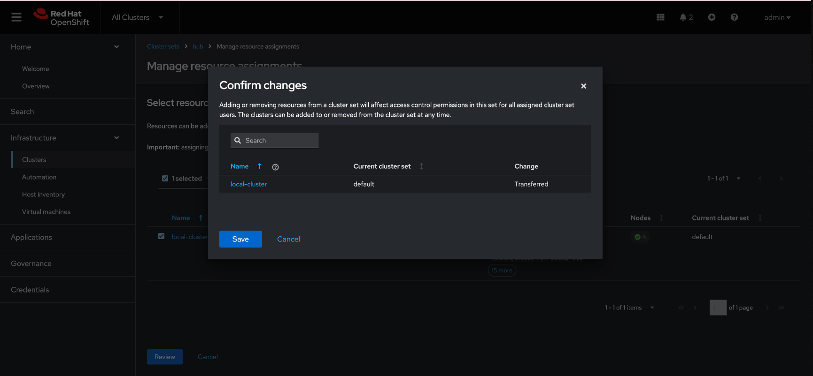
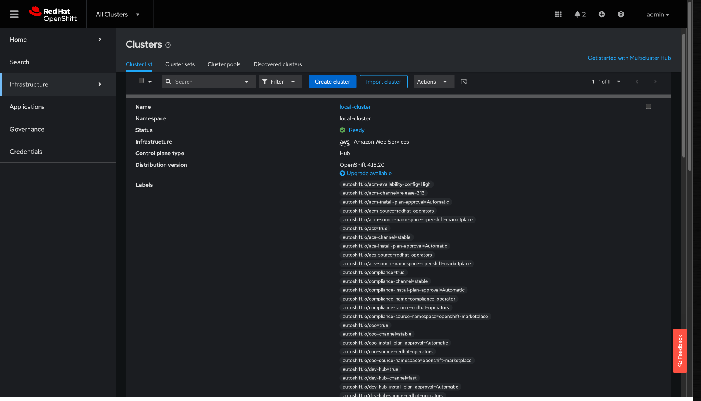

# AutoShiftv2

## What is AutoShift?

AutoShiftv2 is an opinionated [Infrastructure-as-Code (IaC)](https://martinfowler.com/bliki/InfrastructureAsCode.html) framework designed to manage infrastructure components after an OpenShift installation using Advanced Cluster Management (ACM) and OpenShift GitOps. It provides a modular, extensible model to support infrastructure elements deployed on OpenShift — particularly those in [OpenShift Platform Plus](https://www.redhat.com/en/resources/openshift-platform-plus-datasheet). AutoShiftv2 emphasizes ease of adoption, configurable features (taggable on/off), and production-ready capabilities for installation, upgrades, and maintenance.

What AutoShift does is it uses OpenShift GitOps to declaratively manage RHACM which then manages various OpenShift and/or Kubernetes cluster resources and components. This eliminates much of the operator toil associated with installing and managing day 2 tasks, by letting declarative GitOps do that for you.

## Architecture

AutoShiftv2 is built on Red Hat Advanced Cluster Management for Kubernetes (RHACM) and OpenShift GitOps working in concert. RHACM provides visibility into OpenShift and Kubernetes clusters from a single pane of glass, with built-in governance, cluster lifecycle management, application lifecycle management, and observability features. OpenShift GitOps provides declarative GitOps for multicluster continuous delivery.

The hub cluster is the main cluster with RHACM and its core components installed on it, and is also hosting the OpenShift GitOps instance that declaratively manages RHACM.

### Hub Architecture


### Hub of Hubs Architecture

[Red Hat YouTube: RHACM MultiCluster Global Hub](https://www.youtube.com/watch?v=jg3Zr7hFzhM)



## Installation Instructions

### Assumptions / Prerequisites

* A Red Hat OpenShift cluster at 4.18+ to act as the **hub** cluster
* Fork or clone this repo on the machine from which you will be executing this repo
* [helm](https://helm.sh/docs/intro/install/) installed locally on the machine from which you will be executing this repo
* The OpenShift CLI [oc](https://docs.redhat.com/en/documentation/openshift_container_platform/latest/html/cli_tools/openshift-cli-oc#installing-openshift-cli) client utility installed locally on the machine from which you will be executing this repo

### Prepping for Installation

1.  Login to the **hub** cluster via the [`oc` utility](https://docs.redhat.com/en/documentation/openshift_container_platform/latest/html/cli_tools/openshift-cli-oc#cli-logging-in_cli-developer-commands).

    ```console
    oc login --token=sha256~lQ...dI --server=https://api.cluster.example.com:6443
    ```

> [!NOTE]
> Alternatively you can use the devcontainer provided by this repository. By default the container will install the stable version of `oc` and the latest Red Hat provided version of `helm`. These versions can be specified by setting the `OCP_VERSION` and `HELM_VERSION` variables before building. From the container you can login as usual with `oc login` or copy your kubeconfig into the container `podman cp ${cluster_dir}/auth/kubeconfig ${container-name}:/workspaces/.kube/config`.

2.  If installing in a disconnected or internet-disadvantaged environment, update the values in `policies/openshift-gitops/values.yaml` and `policies/advanced-cluster-management/values.yaml` with the source mirror registry, otherwise leave these values as is.

3.  If your clone of AutoShiftv2 requires credentials or you would like to add credentials to any other git repos you can do this in the `openshift-gitops/values` file before installing. This can also be done in the OpenShift GitOps GUI after install.

### Installing OpenShift GitOps

1.  Using helm, install OpenShift GitOps

    ```console
    helm upgrade --install openshift-gitops openshift-gitops -f policies/openshift-gitops/values.yaml
    ```

> [!NOTE]
> If OpenShift GitOps is already installed manually on cluster and the default argo instance exists this step can be skipped. Make sure that argocd controller has cluster-admin

2.  After the installation is complete, verify that all the pods in the `openshift-gitops` namespace are running. This can take a few minutes depending on your network to even return anything.

    ```console
    oc get pods -n openshift-gitops
    ```

    This command should return something like this:

    ```console
    NAME                                                      	      READY   STATUS    RESTARTS   AGE
    cluster-b5798d6f9-zr576                                   	      1/1 	  Running   0          65m
    kam-69866d7c48-8nsjv                                      	      1/1 	  Running   0          65m
    openshift-gitops-application-controller-0                 	      1/1 	  Running   0          53m
    openshift-gitops-applicationset-controller-6447b8dfdd-5ckgh       1/1 	  Running   0          65m
    openshift-gitops-dex-server-569b498bd9-vf6mr                      1/1     Running   0          65m
    openshift-gitops-redis-74bd8d7d96-49bjf                   	      1/1 	  Running   0          65m
    openshift-gitops-repo-server-c999f75d5-l4rsg              	      1/1 	  Running   0          65m
    openshift-gitops-server-5785f7668b-wj57t                  	      1/1 	  Running   0          53m
    ```

3.  Verify that the pod/s in the `openshift-gitops-operator` namespace are running.

    ```console
    oc get pods -n openshift-gitops-operator
    ```

    This command should return something like this:

    ```
    NAME                                                            READY   STATUS    RESTARTS   AGE
    openshift-gitops-operator-controller-manager-664966d547-vr4vb   2/2     Running   0          65m
    ```

4.  Now test if OpenShift GitOps was installed correctly, this may take some time

    ```console
    oc get argocd -A
    ```

    This command should return something like this:

    ```console
    NAMESPACE          NAME               AGE
    openshift-gitops   infra-gitops       29s
    ```

    If this is not the case you may need to run `helm upgrade ...` command again.

### Install Advanced Cluster Management (ACM)

1.  Using helm, install OpenShift Advanced Cluster Management on the hub cluster

    ```console
    helm upgrade --install advanced-cluster-management advanced-cluster-management -f policies/advanced-cluster-management/values.yaml
    ```

2.  Test if Red Hat Advanced Cluster Management has installed correctly, this may take some time

    ```console
    oc get mch -A -w
    ```

    This command should return something like this:

    ```console
    NAMESPACE                 NAME              STATUS       AGE     CURRENTVERSION   DESIREDVERSION
    open-cluster-management   multiclusterhub   Installing   2m35s                    2.13.2
    open-cluster-management   multiclusterhub   Installing   2m39s                    2.13.2
    open-cluster-management   multiclusterhub   Installing   3m12s                    2.13.2
    open-cluster-management   multiclusterhub   Installing   3m41s                    2.13.2
    open-cluster-management   multiclusterhub   Installing   4m11s                    2.13.2
    open-cluster-management   multiclusterhub   Installing   4m57s                    2.13.2
    open-cluster-management   multiclusterhub   Installing   5m15s                    2.13.2
    open-cluster-management   multiclusterhub   Installing   5m51s                    2.13.2
    open-cluster-management   multiclusterhub   Running      6m28s   2.13.2           2.13.2
    ```
> [!NOTE]
> This does take roughly 10 min to install. You can proceed to installing AutoShift while this is installing but you will not be able to verify AutoShift or select a `clusterset` until this is finished.

### Install AutoShiftv2

> [!TIP]
> The previously installed OpenShift GitOps and ACM will be controlled by Autoshift after it is installed for version upgrading

1.  Update `autoshift/values.yaml` with desired feature flags and repo url as define in [Autoshift Cluster Labels Values Reference](#Autoshift-Cluster-Labels-Values-Reference)

2.  Using helm and the values you set for cluster labels, install autoshift. Here is an example using the hub values file:

    ```console
    export APP_NAME="autoshift"
    export REPO_URL="https://github.com/auto-shift/autoshiftv2.git"
    export TARGET_REVISION="main"
    export VALUES_FILE="values.hub.yaml"
    export ARGO_PROJECT="default"
    export GITOPS_NAMESPACE="openshift-gitops"
    cat << EOF | oc apply -f -
    apiVersion: argoproj.io/v1alpha1
    kind: Application
    metadata:
      name: $APP_NAME
      namespace: $GITOPS_NAMESPACE
    spec:
      destination:
        namespace: ''
        server: https://kubernetes.default.svc
      source:
        path: autoshift
        repoURL: $REPO_URL
        targetRevision: $TARGET_REVISION
        helm:
          valueFiles:
            - $VALUES_FILE
          values: |-
            autoshiftGitRepo: $REPO_URL
            autoshiftGitBranchTag: $TARGET_REVISION
      sources: []
      project: $ARGO_PROJECT
      syncPolicy:
        automated:
          prune: false
          selfHeal: true
    EOF
    ```

3.  Given the labels and cluster sets specified in the supplied values file, ACM cluster sets will be created. To view the cluster sets, In the OpenShift web console go to **All Clusters > Infrastructure > Clusters > Cluster Sets** in the ACM Console

    

4.  Select add cluster and manage resource assignments.

    

5.  Manually select which cluster will belong to each cluster set, or when provisioning a new cluster from ACM you can select the desired cluster set from ACM at time of creation.

    

6. Confirm the selected cluster.

    

5.  That's it. Welcome to OpenShift Platform Plus and all of it's many capabilities!

    

## Autoshift Cluster Labels Values Reference

Values can be set on a per cluster and clusterset level to decide what features of autoshift will be applied to each cluster. If a value is defined in helm values, a clusterset label and a cluster label precedence will be **cluster > clusterset > helm** values where helm values is the least. Helm values, `values.yaml` are meant to be defaults.

## Operator Version Control

AutoShift v2 provides comprehensive version control for all managed operators through cluster labels. This feature allows you to pin operators to specific versions while maintaining automatic upgrade capabilities when desired.

### Version Control Behavior

When you specify a version for an operator:
- **Manual Install Plan Approval**: The operator subscription is automatically set to manual approval mode
- **Version Pinning**: ACM will only approve install plans for the exact CSV (ClusterServiceVersion) specified
- **Controlled Upgrades**: Operators will not automatically upgrade beyond the specified version

When no version is specified:
- **Automatic Upgrades**: Operators use automatic install plan approval and follow normal upgrade paths
- **Channel-based Updates**: Operators receive updates based on their configured channel (stable, latest, etc.)

### Setting Operator Versions

Operator versions are controlled through the AutoShift values files (`autoshift/values.hub.yaml`, `autoshift/values.sbx.yaml`, etc.) using cluster labels with the pattern `autoshift.io/OPERATOR_NAME-version`:

```yaml
# Example: Pin Advanced Cluster Security to specific version
hubClusterSets:
  hub:
    labels:
      acs: 'true'
      acs-version: 'rhacs-operator.v4.6.1'

# Example: Pin OpenShift Pipelines to specific version
managedClusterSets:
  managed:
    labels:
      pipelines: 'true'
      pipelines-version: 'openshift-pipelines-operator-rh.v1.18.1'

# Example: Remove version pinning (enables automatic upgrades)
# Simply remove or comment out the version label
# acs-version: 'rhacs-operator.v4.6.1'
```

Labels can also be set at the individual cluster level in the `clusters:` section to override cluster set defaults.

### Available Version Labels

Every managed operator supports version control via its respective label:

| Operator | Version Label | Example CSV |
|----------|--------------|-------------|
| Advanced Cluster Management | `acm-version` | `advanced-cluster-management.v2.14.0` |
| Advanced Cluster Security | `acs-version` | `rhacs-operator.v4.6.1` |
| OpenShift GitOps | `gitops-version` | `openshift-gitops-operator.v1.18.0` |
| OpenShift Pipelines | `pipelines-version` | `openshift-pipelines-operator-rh.v1.18.1` |
| OpenShift Data Foundation | `odf-version` | `odf-operator.v4.18.11-rhodf` |
| MetalLB | `metallb-version` | `metallb-operator.v4.18.0-202509240837` |
| Quay | `quay-version` | `quay-operator.v3.15.0` |
| Developer Hub | `dev-hub-version` | `rhdh.v1.5.0` |
| Developer Spaces | `dev-spaces-version` | `devspaces.v3.21.0` |
| Trusted Artifact Signer | `tas-version` | `rhtas-operator.v1.2.0` |
| Loki | `loki-version` | `loki-operator.v6.3.0` |
| OpenShift Logging | `logging-version` | `cluster-logging.v6.3.0` |
| Cluster Observability | `coo-version` | `cluster-observability-operator.v0.4.0` |
| Compliance Operator | `compliance-version` | `compliance-operator.v1.8.0` |
| LVM Storage | `lvm-version` | `lvms-operator.v4.18.0-202410091522` |
| Local Storage | `local-storage-version` | `local-storage-operator.v4.18.0-202410091522` |
| NMState | `nmstate-version` | `kubernetes-nmstate-operator.v4.18.0-202410091522` |
| OpenShift Virtualization | `virt-version` | `kubevirt-hyperconverged.v4.18.0` |

### Finding Available CSV Versions

To find available CSV versions for operators, use the OpenShift CLI:

```bash
# List available CSV versions for an operator
oc get packagemanifests rhacs-operator -o jsonpath='{.status.channels[*].currentCSV}'

# Get all available versions in a channel
oc get packagemanifests openshift-pipelines-operator-rh -o yaml | grep currentCSV
```

> **Note**: Version control removes the need for install-plan-approval labels, as version specification automatically handles install plan management through ACM governance.


### Advanced Cluster Manager

> [!WARNING]
> Hub Clusters Only

| Variable                    | Type      | Default Value             | Notes |
|-----------------------------|-----------|---------------------------|-------|
| `self-managed`              | bool      | `true` or `false`         |       |
| `acm-channel`               | string    | `release-2.14`            |       |
| `acm-version`               | string    | (optional)                | Specific CSV version for controlled upgrades |
| `acm-source`                | string    | `redhat-operators`        |       |
| `acm-source-namespace`      | string    | `openshift-marketplace`   |       |
| `acm-availability-config`   | string    | `Basic` or `High`         |       |
| `acm-observability`         | bool      | `true` or `false`         | this will enable observability utilizing a nooba bucket for acm. ODF will have to be enabled as well |

### Cluster Labels

Manages the automated cluster labeling system that applies `autoshift.io/` prefixed labels to clusters and cluster sets. This policy automatically propagates labels from cluster sets to individual clusters and manages the label hierarchy.

### MetalLB

| Variable                            | Type              | Default Value             | Notes |
|-------------------------------------|-------------------|---------------------------|-------|
| `metallb`                           | bool              | `true` or `false`         | If not set MetalLB will not be managed |
| `metallb-source`                    | string            | redhat-operators          |  |
| `metallb-source-namespace`          | string            | openshift-marketplace     |  |
| `metallb-version`                   | string            | (optional)                | Specific CSV version for controlled upgrades |
| `metallb-channel`                   | string            | stable                    |  |
| `metallb-quota`                     | bool              | `false`                   | Enable resource quotas for MetalLB namespace |
| `metallb-quota-cpu`                 | int               | `2`                       | Number of cpu for Resource Quota on namespace |
| `metallb-quota-memory`              | string            | 2Gi                       | Amount of memory for Resource Quota on namespace (example: 2Gi or 512Mi) |
| `metallb-ippool-1`                  | string            |                           | Name of config file for IP Pool (copy this value if more than one, increasing number each time) |
| `metallb-l2-1`                      | string            |                           | Name of config file for L2 Advertisement (copy this value if more than one, increasing number each time) |
| `metallb-bgp-1`                     | string            |                           | Name of config file for BGP Advertisement (copy this value if more than one, increasing number each time) |
| `metallb-peer-1`                    | string            |                           | Name of config file for BGP Peer (copy this value if more than one, increasing number each time) |

### OpenShift GitOps

Manages the OpenShift GitOps operator installation and systems ArgoCD instance. This policy ensures the GitOps operator is installed and creates the main ArgoCD instance used by AutoShift to declaratively manage all cluster configurations.

| Variable                        | Type      | Default Value             | Notes |
|---------------------------------|-----------|---------------------------|-------|
| `gitops`                        | bool      |                           | If not set to `true`, OpenShift GitOps will not be managed |
| `gitops-channel`                | string    | `latest`                  | Operator channel for GitOps updates |
| `gitops-version`                | string    | (optional)                | Specific CSV version for controlled upgrades |
| `gitops-source`                 | string    | `redhat-operators`        | Operator catalog source |
| `gitops-source-namespace`       | string    | `openshift-marketplace`   | Namespace for operator catalog |

### Master Nodes

Single Node OpenShift clusters as well as Compact Clusters have to rely on their master nodes to handle workloads. You may have to increase the number of pods per node in these resource constrained environments.

| Variable                          | Type              | Default Value             | Notes |
|-----------------------------------|-------------------|---------------------------|-------|
| `master-nodes`                    | bool              | `false`                   |       |
| `master-max-pods`                 | int               | `250`                     | The number of maximum pods per node. Up to 2500 supported dependent on hardware |

### Machine Health Checks

| Variable                          | Type              | Default Value             | Notes |
|-----------------------------------|-------------------|---------------------------|-------|
| `machine-health-checks`           | bool              |                           | If not set Machine Health Checks will not be managed |
| `machine-health-checks-zones`     | <list<String>>    |                           | List of availability zones for health checks. Automated node health monitoring and remediation |

### Infra Nodes

| Variable                            | Type              | Default Value             | Notes |
|-------------------------------------|-------------------|---------------------------|-------|
| `infra-nodes`                       | int               |                           | Number of infra nodes. If not set infra nodes are not managed, if 0 infra nodes will be deleted |
| `infra-nodes-provider`              | string            |                           | Provider type - 'aws', 'vmware', or 'test' |
| `infra-nodes-instance-type`         | string            |                           | AWS instance type |
| `infra-nodes-numcpu`                | int               |                           | Number of cpu per infra node |
| `infra-nodes-memory-mib`            | int               |                           | Memory mib per infra node |
| `infra-nodes-numcores-per-socket`   | int               |                           | Number of CPU Cores per socket |
| `infra-nodes-zone-[number]`         | string            |                           | Availability zone (e.g., infra-nodes-zone-1: 'us-east-2a') |


### Worker Nodes

| Variable                            | Type              | Default Value             | Notes |
|-------------------------------------|-------------------|---------------------------|-------|
| `worker-nodes`                      | int               |                           | Number of worker nodes min if autoscale. If not set worker nodes are not managed, if blank worker nodes will be deleted |
| `worker-nodes-numcpu`               | int               |                           | Number of cpu per worker node |
| `worker-nodes-memory-mib`           | int               |                           | Memory mib per worker node |
| `worker-nodes-numcores-per-socket`  | int               |                           | Number of CPU Cores per socket |
| `worker-nodes-zones`                | <list<String>>    |                           | List of availability zones |

### Storage Nodes

| Variable                            | Type           | Default Value | Notes |
| ----------------------------------- | -------------- | ------------- | ----- |
| `storage-nodes`                     | int            |               | Number of storage nodes min if autoscale. If not set storage nodes are not managed, if blank storage nodes will be deleted. Local Storage Operator will be installed if Storage Nodes are enabled |
| `storage-nodes-numcpu`              | int            |               | Number of cpu per storage node  |
| `storage-nodes-memory-mib`          | int            |               | Memory mib per storage node |
| `storage-nodes-numcores-per-socket` | int            |               | Number of CPU Cores per socket |
| `storage-nodes-zone-[number]`       | string         |               | Availability zone (e.g., storage-nodes-zone-1: 'us-east-2a') |
| `storage-nodes-instance-type`       | string         |               | Instance type for cloud provider |
| `storage-nodes-provider`            | string         |               | Provider type; valid choices: aws, vmware, baremetal |
| `storage-nodes-node-[iterator]`     | <list<String>> |               | List of node names to apply storage label to. Used for baremetal where MachineSets aren't used. |

### Advanced Cluster Security

| Variable                          | Type              | Default Value             | Notes |
|-----------------------------------|-------------------|---------------------------|-------|
| `acs`                             | bool              |                           | If not set Advanced Cluster Security will not be managed |
| `acs-egress-connectivity`         | string            | `Online`                  | Options are `Online` or `Offline`, use `Offline` if disconnected |
| `acs-channel`                     | string            | `stable`                  |       |
| `acs-version`                     | string            | (optional)                | Specific CSV version for controlled upgrades |
| `acs-source`                      | string            | `redhat-operators`        |       |
| `acs-source-namespace`            | string            | `openshift-marketplace`   |       |

### Developer Spaces

| Variable                              | Type              | Default Value             | Notes |
|---------------------------------------|-------------------|---------------------------|-------|
| `dev-spaces`                          | bool              |                           | If not set Developer Spaces will not be managed |
| `dev-spaces-channel`                  | string            | `stable`                  |       |
| `dev-spaces-version`                  | string            | (optional)                | Specific CSV version for controlled upgrades |
| `dev-spaces-source`                   | string            | `redhat-operators`        |       |
| `dev-spaces-source-namespace`         | string            | `openshift-marketplace`   |       |

### Developer Hub

| Variable                          | Type              | Default Value             | Notes |
|-----------------------------------|-------------------|---------------------------|-------|
| `dev-hub`                         | bool              |                           | If not set Developer Hub will not be managed |
| `dev-hub-channel`                 | string            | `fast`                    |       |
| `dev-hub-version`                 | string            | (optional)                | Specific CSV version for controlled upgrades |
| `dev-hub-source`                  | string            | `redhat-operators`        |       |
| `dev-hub-source-namespace`        | string            | `openshift-marketplace`   |       |

### OpenShift Pipelines

| Variable                          | Type              | Default Value             | Notes |
|-----------------------------------|-------------------|---------------------------|-------|
| `pipelines`                       | bool              |                           | If not set OpenShift Pipelines will not be managed |
| `pipelines-channel`               | string            | `latest`                  |       |
| `pipelines-version`               | string            | (optional)                | Specific CSV version for controlled upgrades |
| `pipelines-source`                | string            | `redhat-operators`        |       |
| `pipelines-source-namespace`      | string            | `openshift-marketplace`   |       |

### Trusted Artifact Signer

| Variable                          | Type              | Default Value             | Notes |
|-----------------------------------|-------------------|---------------------------|-------|
| `tas`                             | bool              |                           | If not set Trusted Artifact Signer will not be managed |
| `tas-channel`                     | string            | `stable`                  |       |
| `tas-version`                     | string            | (optional)                | Specific CSV version for controlled upgrades |
| `tas-source`                      | string            | `redhat-operators`        |       |
| `tas-source-namespace`            | string            | `openshift-marketplace`   |       |

### Quay

| Variable                          | Type              | Default Value             | Notes |
|-----------------------------------|-------------------|---------------------------|-------|
| `quay`                            | bool              |                           | If not set Quay will not be managed |
| `quay-channel`                    | string            | `stable-3.13`             |       |
| `quay-version`                    | string            | (optional)                | Specific CSV version for controlled upgrades |
| `quay-source`                     | string            | `redhat-operators`        |       |
| `quay-source-namespace`           | string            | `openshift-marketplace`   |       |

### OpenShift Virtualization

| Variable                          | Type              | Default Value             | Notes |
|-----------------------------------|-------------------|---------------------------|-------|
| `virt`                            | bool              |                           | If not set OpenShift Virtualization will not be managed |
| `virt-channel`                    | string            | `stable`                  | KubeVirt-based virtualization platform for running VMs on OpenShift |
| `virt-version`                    | string            | (optional)                | Specific CSV version for controlled upgrades |
| `virt-source`                     | string            | `redhat-operators`        |       |
| `virt-source-namespace`           | string            | `openshift-marketplace`   |       |

### Developer OpenShift Gitops

| Variable                              | Type              | Default Value             | Notes |
|---------------------------------------|-------------------|---------------------------|-------|
| `gitops-dev`                          | bool              |                           | If not set Developer OpenShift Gitops intances will not be managed |
| `gitops-dev-team-{INSERT_TEAM_NAME}`  | string        |                           | Team that can deploy onto cluster from dev team gitops. Must match a team in the `gitops-dev` helm chart values file |

### Loki

| Variable                          | Type              | Default Value             | Notes |
|-----------------------------------|-------------------|---------------------------|-------|
| `loki`                            | bool              |                           | If not set Loki will not be managed. Dependent on ODF Multi Object Gateway |
| `loki-channel`                    | string            | `stable-6.2`              |       |
| `loki-version`                    | string            | (optional)                | Specific CSV version for controlled upgrades |
| `loki-source`                     | string            | `redhat-operators`        |       |
| `loki-source-namespace`           | string            | `openshift-marketplace`   |       |
| `loki-size`                       | string            | `1x.extra-small`          |       |
| `loki-storageclass`               | string            | `gp3-csi`                 |       |
| `loki-lokistack-name`             | string            | `logging-lokistack`       |       |

### OpenShift Logging

| Variable                          | Type              | Default Value             | Notes |
|-----------------------------------|-------------------|---------------------------|-------|
| `logging`                         | bool              |                           | If not set OpenShift Logging will not be managed, Dependent on Loki and COO |
| `logging-channel`                 | string            | `stable-6.2`              |       |
| `logging-version`                 | string            | (optional)                | Specific CSV version for controlled upgrades |
| `logging-source`                  | string            | `redhat-operators`        |       |
| `logging-source-namespace`        | string            | `openshift-marketplace`   |       |

### Cluster Observability Operator

| Variable                          | Type              | Default Value             | Notes |
|-----------------------------------|-------------------|---------------------------|-------|
| `coo`                             | bool              |                           | If not set Cluster Observability Operator will not be managed |
| `coo-channel`                     | string            | `stable`                  |       |
| `coo-version`                     | string            | (optional)                | Specific CSV version for controlled upgrades |
| `coo-source`                      | string            | `redhat-operators`        |       |
| `coo-source-namespace`            | string            | `openshift-marketplace`   |       |

### Compliance Operator STIG Apply

| Variable                              | Type              | Default Value             | Notes |
|---------------------------------------|-------------------|---------------------------|-------|
| `compliance`                          | bool              |                           | If not set Compliance Operator will not be managed. Helm chart config map must be set with profiles and remediations |
| `compliance-name`                     | string            | `compliance-operator`     |       |
| `compliance-version`                  | string            | (optional)                | Specific CSV version for controlled upgrades |
| `compliance-source`                   | string            | `redhat-operators`        |       |
| `compliance-source-namespace`         | string            | `openshift-marketplace`   |       |
| `compliance-channel`                  | string            | `stable`                  |       |

### LVM Operator

| Variable                              | Type              | Default Value             | Notes |
|---------------------------------------|-------------------|---------------------------|-------|
| `lvm`                                 | bool              | `false`                   | If not set the LVM Operator will not be managed |
| `lvm-channel`                         | string            | `stable-4.18`             | Operator channel |
| `lvm-version`                         | string            | (optional)                | Specific CSV version for controlled upgrades |
| `lvm-source`                          | string            | `redhat-operators`        | Operator catalog source |
| `lvm-source-namespace`                | string            | `openshift-marketplace`   | Catalog namespace |
| `lvm-default`                         | bool              | `true`                    | Sets the lvm-operator as the default Storage Class |
| `lvm-fstype`                          | string            | `xfs`                     | Options `xfs` `ext4` |
| `lvm-size-percent`                    | int               | `90`                      | Percentage of the Volume Group to use for the thinpool |
| `lvm-overprovision-ratio`             | int               | `10`                      |       |

### Local Storage Operator

| Variable                              | Type              | Default Value             | Notes |
|---------------------------------------|-------------------|---------------------------|-------|
| `local-storage`                       | bool              |                           | if not set to true, local storage will not be managed or deployed. |
| `local-storage-channel`               | string            | `stable`                  | Operator channel |
| `local-storage-version`               | string            | (optional)                | Specific CSV version for controlled upgrades |
| `local-storage-source`                | string            | `redhat-operators`        | Operator catalog source |
| `local-storage-source-namespace`      | string            | `openshift-marketplace`   | Catalog namespace |

### OpenShift Data Foundation

| Variable                          | Type              | Default Value             | Notes |
|-----------------------------------|-------------------|---------------------------|-------|
| `odf`                             | bool              |                           | If not set OpenShift Data Foundation will not be managed. if Storage Nodes are enable will deploy ODF on local storage/ storage nodes |
| `odf-multi-cloud-gateway`         | string            |                           | values `standalone` or `standard`. Install ODF with only nooba object gateway or full odf |
| `odf-nooba-pvpool`                | bool              |                           | if not set nooba will be deployed with default settings. Recomended don't set for cloud providers. Use pv pool for storage |
| `odf-nooba-store-size`            | string            |                           | example `500Gi`. if pvpool set. Size of nooba backing store |
| `odf-nooba-store-num-volumes`     | string            |                           | example `1`. if pvpool set. number of volumes |
| `odf-ocs-storage-class-name`      | string            |                           | if not using local-storage, storage class to use for ocs |
| `odf-ocs-storage-size`            | string            |                           | storage size per nvme |
| `odf-ocs-storage-count`           | string            |                           | number of replica sets of nvme drives, note total amount will count * replicas |
| `odf-ocs-storage-replicas`        | string            |                           | replicas, `3` is recommended; if using flexibleScaling use `1` |
| `odf-ocs-flexible-scaling`        | bool              | `false`*                  | Sets failure domain to host and evenly spreads OSDs over hosts. Defaults to true on baremetal with a number of storage nodes that isn't a multiple of 3 |
| `odf-resource-profile`            | string            | `balanced`                | `lean`: suitable for clusters with limited resources, `balanced`: suitable for most use cases, `performance`: suitable for clusters with high amount of resources |
| `odf-channel`                     | string            | `stable-4.18`             |       |
| `odf-version`                     | string            | (optional)                | Specific CSV version for controlled upgrades |
| `odf-source`                      | string            | `redhat-operators`        |       |
| `odf-source-namespace`            | string            | `openshift-marketplace`   |       |

### OpenShift Internal Registry
| Variable                          | Type              | Default Value             | Notes |
|-----------------------------------|-------------------|---------------------------|-------|
| `imageregistry`                   | bool              | `false`                   | If not set OpenShift Internal Image Registry will not be managed |
| `imageregistry-management-state`  | string            | `Managed`                 | Can be set to `Managed` and `Unmanaged`, though only `Managed` is supported |
| `imageregistry-replicas`          | int               |                           | Need at least `2`, as well as read write many storage or object/s3 storage in order support HA and Rolling Updates |
| `imageregistry-storage-type`      | string            |                           | Supported `s3` or `pvc`, s3 only supports Nooba |
| `imageregistry-s3-region`         | string            |                           | If type is `s3` you can specify a region |
| `imageregistry-pvc-access-mode`   | string            |                           | Example `ReadWriteMany` |
| `imageregistry-pvc-storage`       | string            | `100Gi`                   | PVC size (default: '100Gi') |
| `imageregistry-pvc-storage-class` | string            |                           | Example `ocs-storagecluster-ceph-rbd` |
| `imageregistry-pvc-volume-mode`   | string            | `Filesystem`              | Example `Block` or `Filesystem` |
| `imageregistry-rollout-strategy`  | string            | `Recreate`                | Example `RollingUpdate` if at least 2 or `Recreate` if only 1 |

### OpenShift DNS

| Variable                          | Type              | Default Value             | Notes |
|-----------------------------------|-------------------|---------------------------|-------|
| `dns-tolerations`                 | bool              |                           | If set, applies DNS operator tolerations for specialized node configurations |
| `dns-node-placement`              | string            |                           | Node placement configuration for DNS pods |

### Kubernetes NMState Operator

The Kubernetes NMState Operator can be used to declaratively configure the Red Hat Core OS network settings. Common uses are adding bonds, vlans, and bridges. This helm chart works with AutoShift v2. This helm chart ingests every file in `policies/nmstate/files/` (with the exception of any file ending with the extension `.example`) and applies them as a ConfigMap on the hub cluster. Cluster labels are used to choose which cluster gets a configuration. If you want a cluster to have a config applied to it, you must label it with a label that starts with `autoshift.io/nmstate-nncp-` and has a value of the name of the file. For example the configuration file `example-1g-bond.yaml` can be applied to a cluster by applying label: `nmstate-nncp-example-bond1: example-1g-bond`. To further select specific nodes within a cluster, nodeSelectors can be used. To get started you can copy an example file such as `policies/nmstate/files/bond.yaml.example` and change the `nmstate:` configuration as required. The NMState YAML API is well documented at: [nmstate | A Declarative API for Host Network Management](https://nmstate.io/devel/yaml_api.html).

| Variable                        | Type           | Default Value         | Notes                                                                             |
| ------------------------------- | -------------- | --------------------- | --------------------------------------------------------------------------------- |
| `nmstate`                       | bool           | false                 | If not set the Kubernetes NMState Operator will not be managed                    |
| `nmstate-nncp-<name>`           | string         | omitted               | Filename of NMState config that exists in files. Can be specified multiple times with unique suffixes. |
| `nmstate-channel`               | string         | stable                |                                                                                   |
| `nmstate-version`               | string         | (optional)            | Specific CSV version for controlled upgrades                                     |
| `nmstate-source`                | string         | redhat-operators      |                                                                                   |
| `nmstate-source-namespace`      | string         | openshift-marketplace |                                                                                   |

### Manual Remediations

Provides manual fixes and configurations that cannot be automated through operators, including managing allowed image registries for enhanced security.

| Variable                          | Type              | Default Value             | Notes |
|-----------------------------------|-------------------|---------------------------|-------|
| `manual-remediations`             | bool              |                           | If not set Manual Remediations will not be managed |
| `allowed-registries`              | <list<String>>    |                           | List of allowed container image registries. Controls which registries can be used for pulling images |

## References

* [OpenShift Platform Plus DataShift](https://www.redhat.com/en/resources/openshift-platform-plus-datasheet)
* [Red Hat Training: DO480: Multicluster Management with Red Hat OpenShift Platform Plus](https://www.redhat.com/en/services/training/do480-multicluster-management-red-hat-openshift-platform-plus)
* [Martin Fowler Blog: Infrastructure As Code](https://martinfowler.com/bliki/InfrastructureAsCode.html)
* [helm Utility Installation Instructions](https://helm.sh/docs/intro/install/)
* [OpenShift CLI Client `oc` Installation Instructions](https://docs.redhat.com/en/documentation/openshift_container_platform/latest/html/cli_tools/openshift-cli-oc#installing-openshift-cli)
